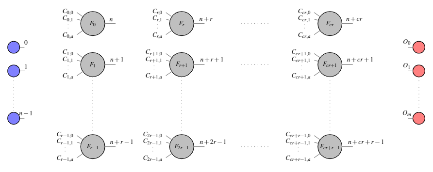

# Summary

Genetic Programming (GP), is a computer technique based on the idea of representing a computer program as some sort of tree (data-structure) and evolving it using genetic algorithms as to improve its *fitness* at solving a predefined task. The idea flourished in the late 80s mainly thanks to the work of John Koza [@koza:2010], and (using the words of Koza) has always had a major *skeleton in the closet*: the difficulty to find and evolve real valued parameters in the expressed program. A recent development called **differentiable
genetic programming** [@izzo:2017], was introduced to address exactly this issue by allowing to learn constants in computer programs using the
differential information of the program outputs as obtained using automated differentiation techniques. 

The evolution of a **differentiable genetic program** can be supported by using the information on the derivatives of the program outputs with respect to chosen parameters, enabling in GP the equivalent of back-propagation in Artificial Neural Networks (ANN). The fitness of a program can thus be defined in terms of the derivatives, allowing to go beyond symbolic regression tasks and, for example, to solve differential equations, learn differential models, capture conserved quantities in dynamical systems, search for Lyapunov functions in controlled systems, etc..

In this work we introduce the C++ library `dcgp` exposed in the Python package `dcgpy`, a tool that allows research into the applications enabled by **differentiable genetic programming**.

# Methods 

In `dcgp` computer programs are encoded using the Cartesia Genetic Programming (CGP) encoding [@miller:2011], that is an acyclic graph
representation of the program. A Cartesian genetic program, in its original form, is depicted in \autoref{fig:cgp}, and is defined by the number of inputs $n$, the number of outputs $m$, the number of rows $r$, the number of columns $c$, the levels-back $l$, the arity $a$ of its kernels (non-linearities) and the set of possible operations, or *kernels*. With reference to \autoref{fig:cgp}, each of the $n + rc$ nodes in a CGP is assigned a unique id. The vector of integers:
$$
\mathbf x_I = [F_0, C_{0,0}, C_{0,1}, ...,  C_{0, a}, F_1, C_{1,0}, ....., O_1, O_2, ..., O_m]
$$
defines entirely the value of the terminal nodes and thus the computer program.



In `dcgp` the CGP representations are all derived from the basis class ```dcgp::expression<T>``` which is templated as to allow the 
program to be computed on different types. 


# Examples

## Symbolic Regression

## Artificial Neural Networks

## Others

# Acknowledgments

# References